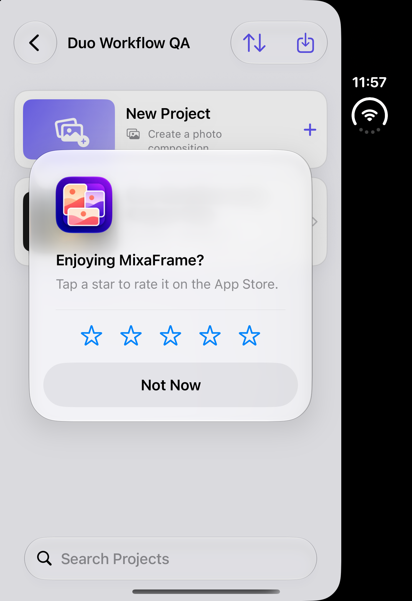

# iPhone Duo simulator validation

Validated on October 7, 2026 with iPhone Duo / iOS 27.1. The interface responds to window geometry; no device-name detection or newer deployment target is required.

## Changes

- Library grids use available width, including expanded Duo screens that report a compact horizontal size class.
- The editor allocates separate canvas and tool regions, with side-by-side controls in wide landscape windows and stacked controls in portrait.
- Full-canvas mode uses the available height for both flow and regular layouts.
- Accessibility text sizes wrap card metadata, stack photo details and export actions, and use a menu for output format. Save sheets, export details, and original-photo crop controls can scroll.
- Viewer controls have stable icon sizes and 44-point targets. Export review uses a dark appearance for readable controls and metadata.
- Long project titles use a multiline editing sheet instead of an alert that clipped at maximum text size.
- Quality descriptions stack at accessibility sizes. Unsaved-change actions appear before the subscription option, whose label wraps independently of its icons.
- Repeated-export choices appear before the preview, use a large sheet at accessibility sizes, and keep permission-status text at its natural height.

## Results

| Check | Result |
| --- | --- |
| Closed Duo, portrait and landscape | Canvas and controls remain separate; all four tool panels reachable. |
| Fully open Duo, portrait and landscape | Library grids and editor resize correctly. |
| Partially open and fold transitions | Active project and original-photo viewer remain open with their state retained. |
| Default and maximum accessibility text | Titles, metadata, photo actions, canvas settings, and export actions are readable; long content scrolls. |
| New collection and project | Created `Duo Workflow QA` in the simulator and imported two sample photos through PhotosPicker. |
| Layout and canvas editing | Selected Mondrian 1 and HD; saved and reopened with both photos and settings retained. |
| Original-photo inspection | Crop guide rendered; zoom reached 150% and reset to 100%; footer scrolls at maximum text size. |
| Export review | Rendered 1080 × 1920 HD JPEG and 3277 × 4096 JPEG from sample projects. |
| Save to Photos | Export asset identifier and saved export file persisted; editor reopened successfully. |
| Repeated export with add-only Photos access | Replacement was disabled with a readable explanation; Create New Photo succeeded and persisted a new asset identifier and export file. |
| Long title and unsaved changes | Edited a long title at maximum text size; Keep Editing returned to the editor; Save and Leave persisted the title and returned to the project list. |
| Native share sheet | Opened with rendered JPEG and dismissed without sending. |
| Duo unit/regression suite | 67 tests passed, zero failures, including workspace geometry and full-canvas coverage. |
| iPhone 17e / iOS 26.5 regression suite | 67 tests passed, zero failures. |

End-to-end workflows and visual checks were performed manually through the simulator UI. The 67 automated tests are unit/regression tests; there is no automated UI-test target. Validation used simulator sample photos and local data. Physical-device testing was not performed. The replacement path requiring full Photos access was not exercised; the add-only fallback was exercised successfully.

## Repeat

### App Store review prompt follow-up

Validated the native rating request on the closed Duo simulator after three separate editor visits. Each visit changed the two-photo project's title and used Save and Leave. The first two visits returned to the project browser without a prompt; after the third, the native “Enjoying MixaFrame?” rating sheet appeared in the browser. Not Now dismissed it successfully. The original project title was restored during the third visit.

The persisted usage count was 3, with version 1.0.2 and the request timestamp recorded. The updated automated suite passed 73 tests, including six policy tests for eligibility, persistence, version limits, cooldown, additional usages, and missing version handling. The native Mac target built successfully. Actual production presentation remains controlled by StoreKit.



### Simulator command

Choose an available Duo simulator in Xcode and run:

```sh
xcodebuild \
  -project MixaFrame.xcodeproj \
  -scheme MixaFrame \
  -destination 'platform=iOS Simulator,name=iPhone Duo' \
  -parallel-testing-enabled NO \
  CODE_SIGNING_ALLOWED=NO test
```

Use Device Hub to switch closed, partially open, and open postures and rotate the device while editing. Repeat Photos → Layouts → Canvas → Export with default text and the largest accessibility text setting. Confirm save/reopen, original-photo zoom/reset, export review, Save to Photos, and share-sheet presentation.
